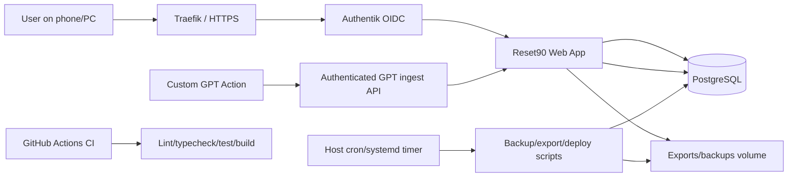
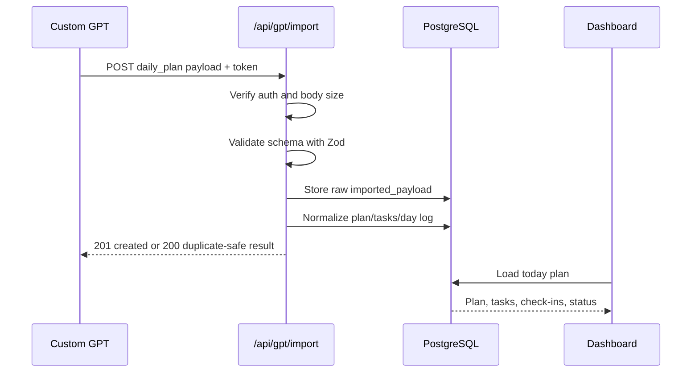

# 02 - System Architecture

    ## Purpose
    Define the technical architecture, runtime components, data flow, boundaries, and deployment shape for Reset90.

    ## Scope
    - High-level architecture for local and production environments.
- Component responsibilities for UI, API, database, auth, GPT ingest, backups, and observability.
- Mandates the accepted high-level architecture: modular monolith, PostgreSQL, Prisma, JSON Schema/Zod import validation, Authentik OIDC for browser auth, separate GPT machine ingest auth, Docker Compose, and Traefik in production.

    ## Assumptions
    - App runs as a web application accessible from PC and phone.
- Production is self-hosted behind HTTPS and Authentik.
- Custom GPT calls a machine-authenticated ingest API.
- PostgreSQL is the source of truth.
- No offline support is required.

    ## Success Criteria
    - Local developer can start the app reliably.
- Production can run with Docker Compose and persistent volumes.
- GPT payloads are authenticated, validated, stored raw, normalized, and visible in UI.
- Backups and exports are designed from the beginning.

    ## Deliverables
    - Architecture diagram.
- Component responsibilities.
- Request/data flows.
- Security boundaries.
- Recommended repository structure.

    ## High-level architecture



## Components

### Web UI

Responsible for:

- Today Command Center;
- energy check-in;
- plan and task display;
- task completion;
- recovery mode;
- 90-day grid;
- weekly reviews;
- context library;
- analytics;
- settings;
- export/download.

### API layer

Responsible for:

- browser UI data requests;
- task/check-in updates;
- GPT ingest;
- payload validation;
- export generation;
- health checks;
- context retrieval.

### Database

Responsible for durable storage of:

- reset cycles and phases;
- daily logs;
- daily plans and tasks;
- check-ins and reflections;
- recovery events;
- weekly reviews;
- imported raw payloads;
- context items and decisions;
- optional embedding records.

### Auth

Browser UI:

- production: Authentik OIDC;
- local: dev auth can be mocked or disabled until OIDC is implemented.

GPT ingest:

- separate bearer token or HMAC signature;
- never use browser session auth for machine ingest;
- rate limit and size limit.

### Backups and exports

- Daily PostgreSQL backups.
- Manual restore script with confirmation.
- Full JSON export from UI/API.
- Optional Markdown summary export.

## Data flow: daily plan import



## Recommended repository structure

```text
app/ or src/app/          Next.js routes/pages
src/components/           UI components
src/lib/                  shared utilities
src/server/               server-only logic
src/server/db/            Prisma client/schema/migrations helper
src/server/imports/       GPT import validation/normalization
src/server/context/       context pack and retrieval logic
src/server/analytics/     metrics and weekly comparisons
scripts/                  operational scripts
docs/                     living documentation
examples/                 payload examples and templates
```

## Security boundaries

- Authentik protects browser routes in production.
- GPT ingest endpoint has dedicated machine auth.
- Admin/export/delete endpoints require browser auth, never GPT token.
- Secrets are environment variables only.
- Logs must not print full journal/reflection content by default.


## Architecture decisions

The current architecture is governed by accepted ADRs:

- ADR-0001: modular monolith.
- ADR-0002: PostgreSQL source of truth.
- ADR-0003: JSON Schema import contracts.
- ADR-0004: separate browser auth and GPT ingest auth.
- ADR-0007: Prisma ORM.
- ADR-0012: Docker Compose and Traefik deployment.
