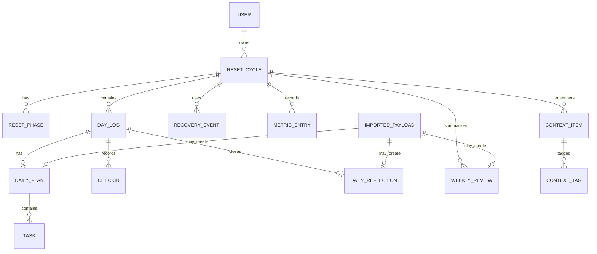

# 03 - System Design and Data Model

    ## Purpose
    Define the concrete database concepts and system design rules needed to implement Reset90 safely.

    ## Scope
    - Logical data model for MVP and near-term features.
- Entities, enums, relationships, and idempotency requirements.
- Optional embeddings are included but not required for MVP.

    ## Assumptions
    - PostgreSQL is used in local and production.
- There is one primary user, but a `users` table is still useful for Authentik subject mapping.
- The app stores raw imported payloads before normalized entities.
- Conversation/context storage must not include hidden chain-of-thought logs.

    ## Success Criteria
    - Schema supports the MVP without large refactors.
- Imports are idempotent.
- Analytics can be generated from normalized data.
- Full export can reconstruct the user’s data.

    ## Deliverables
    - Entity list.
- Enums.
- ERD.
- Table guidance.
- Indexing and migration rules.

    ## Logical ERD



## Core enums

```text
FocusDomain = BODY | MOOD | DIGITAL | LEARNING | WORK | SYSTEM | SOCIAL | RECOVERY
TaskTier = NON_NEGOTIABLE | MINIMUM | STANDARD | IDEAL
EnergyLevel = BURNED_OUT | LOW | NORMAL | HIGH | RESTLESS_CHAOTIC
DayStatus = GREEN | YELLOW | BLUE | RED | GOLD | UNSET
PayloadKind = DAILY_PLAN | DAILY_REFLECTION | WEEKLY_REVIEW | CONTEXT_SUMMARY
ContextKind = CONVERSATION | TASK_SUMMARY | DECISION_LOG | DAILY_SUMMARY | WEEKLY_SUMMARY | CONTEXT_SNAPSHOT | REASONING_SUMMARY
RecoveryType = PLANNED | EMERGENCY_RESET | DOWNSHIFT | COMEBACK
```

## Main tables

### users

Fields:

- `id`
- `authentik_subject`
- `email`
- `display_name`
- `created_at`
- `updated_at`

### reset_cycles

Fields:

- `id`
- `user_id`
- `name`
- `start_date`
- `end_date`
- `status`
- `recovery_credit_limit`
- `created_at`
- `updated_at`

### reset_phases

Fields:

- `id`
- `cycle_id`
- `name`
- `day_start`
- `day_end`
- `description`

Seed default phases:

- 1-30: Clear the Fog
- 31-60: Rebuild Momentum
- 61-90: Prove Continuation

### day_logs

Fields:

- `id`
- `cycle_id`
- `date`
- `day_number`
- `phase_id`
- `energy_level`
- `status`
- `mission`
- `supportive_message`
- `notes`
- `created_at`
- `updated_at`

Unique:

- `(cycle_id, date)`
- `(cycle_id, day_number)`

### daily_plans

Fields:

- `id`
- `day_log_id`
- `imported_payload_id`
- `source`
- `schema_version`
- `mission`
- `downshift_rule`
- `context_summary`
- `created_at`

### tasks

Fields:

- `id`
- `daily_plan_id`
- `title`
- `description`
- `domain`
- `tier`
- `estimate_minutes`
- `trigger`
- `why`
- `completed_at`
- `skipped_at`
- `notes`
- `sort_order`

### checkins

Fields:

- `id`
- `day_log_id`
- `timestamp`
- `energy_level`
- `mood_score`
- `fog_score`
- `loneliness_score`
- `self_criticism_score`
- `digital_control_score`
- `learning_resistance_score`
- `body_relationship_score`
- `work_confidence_score`
- `note`

Scores should use 1-10 integers unless a better scale is explicitly chosen later.

### daily_reflections

Fields:

- `id`
- `day_log_id`
- `imported_payload_id`
- `summary`
- `what_happened`
- `what_worked`
- `what_blocked_me`
- `tomorrow_adjustment`
- `self_criticism_note`
- `day_status_recommendation`
- `created_at`

### weekly_reviews

Fields:

- `id`
- `cycle_id`
- `imported_payload_id`
- `week_number`
- `date_from`
- `date_to`
- `summary`
- `wins_json`
- `blockers_json`
- `patterns_json`
- `recommended_changes_json`
- `next_week_commitments_json`
- `metrics_json`
- `created_at`

### imported_payloads

Fields:

- `id`
- `kind`
- `schema_version`
- `idempotency_key`
- `source`
- `external_conversation_id`
- `raw_json`
- `validation_status`
- `processed_at`
- `created_at`

Unique:

- `idempotency_key`

### context_items

Fields:

- `id`
- `cycle_id`
- `day_log_id` nullable
- `weekly_review_id` nullable
- `kind`
- `title`
- `summary`
- `source_ref`
- `importance`
- `tags_json`
- `embedding_id` nullable
- `created_at`
- `updated_at`

Context items must store user-visible summaries, decisions, and facts. Do not store hidden chain-of-thought.

### embedding_records optional

Fields:

- `id`
- `context_item_id`
- `provider`
- `model`
- `vector`
- `created_at`

Optional MVP decision: create the table later if vector retrieval is implemented. Do not block MVP on embeddings.

## Migration rules

- Every schema change gets a migration.
- Migrations must be safe for production data.
- Before production migrations, run backup.
- Destructive migrations require explicit note in PR and deploy plan.
