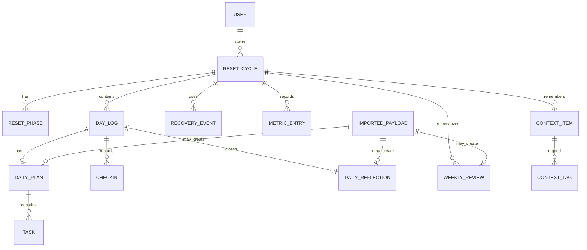

# 03 - System Design and Data Model

    ## Purpose
    Define the concrete database concepts and system design rules needed to implement Reset90 safely.

    ## Scope
    - Logical data model for MVP and near-term features.
- Entities, enums, relationships, and idempotency requirements.
- Optional embeddings are included but not required for MVP.

    ## Assumptions
    - PostgreSQL is used in local and production.
- There is one primary user, but a `users` table is still useful for Authentik subject mapping.
- The app stores raw imported payloads before normalized entities.
- Conversation/context storage must not include hidden chain-of-thought logs.

    ## Success Criteria
    - Schema supports the MVP without large refactors.
- Imports are idempotent.
- Analytics can be generated from normalized data.
- Full export can reconstruct the user’s data.

    ## Deliverables
    - Entity list.
- Enums.
- ERD.
- Table guidance.
- Indexing and migration rules.

    ## Logical ERD



## Core enums

```text
FocusDomain = BODY | MOOD | DIGITAL | LEARNING | WORK | SYSTEM | ENVIRONMENT | SOCIAL | OTHER
TaskTier = NON_NEGOTIABLE | MINIMUM | STANDARD | IDEAL
EnergyLevel = BURNED_OUT | LOW | NORMAL | HIGH | RESTLESS_CHAOTIC
DayStatus = GREEN | YELLOW | BLUE | RED | GOLD | UNSET
PayloadKind = DAILY_PLAN | DAILY_REFLECTION | WEEKLY_REVIEW | CONTEXT_ITEM
ContextKind = CONVERSATION | TASK_SUMMARY | DECISION_LOG | DAILY_SUMMARY | WEEKLY_SUMMARY | CONTEXT_SNAPSHOT | REASONING_SUMMARY
RecoveryType = deferred after Phase 11
CheckinKind = MORNING | MIDDAY | EVENING | MANUAL
```

## Main tables

### users

Fields:

- `id`
- `authentik_subject`
- `email`
- `display_name`
- `created_at`
- `updated_at`

### reset_cycles

Fields:

- `id`
- `user_id`
- `name`
- `start_date`
- `end_date`
- `status`
- `recovery_credit_limit`
- `created_at`
- `updated_at`

### reset_phases

Fields:

- `id`
- `cycle_id`
- `name`
- `day_start`
- `day_end`
- `description`

Seed default phases:

- 1-30: Clear the Fog
- 31-60: Rebuild Momentum
- 61-90: Prove Continuation

### day_logs

Fields:

- `id`
- `cycle_id`
- `date`
- `day_number`
- `phase_id`
- `energy_level`
- `status`
- `mission`
- `supportive_message`
- `notes`
- `created_at`
- `updated_at`

Unique:

- `(cycle_id, date)`
- `(cycle_id, day_number)`

### daily_plans

Fields:

- `id`
- `day_log_id`
- `imported_payload_id`
- `source`
- `schema_version`
- `mission`
- `supportive_message`
- `warnings`
- `downshift_rule`
- `context_summary`
- `created_at`
- `updated_at`

### tasks

Fields:

- `id`
- `daily_plan_id`
- `title`
- `description`
- `domain`
- `tier`
- `estimate_minutes`
- `trigger`
- `why`
- `completed_at`
- `skipped_at`
- `notes`
- `sort_order`
- `created_at`
- `updated_at`

### checkins

Fields:

- `id`
- `day_log_id`
- `kind`
- `timestamp`
- `energy_level`
- `mood_score`
- `fog_score`
- `loneliness_score`
- `self_criticism_score`
- `digital_control_score`
- `learning_resistance_score`
- `body_relationship_score`
- `work_confidence_score`
- `note`

Scores use required 1-10 integers. Higher is better for mood, digital control,
body relationship, and work confidence. Higher is worse for fog, loneliness,
self-criticism, and learning resistance. Notes are optional and limited to 500
characters at the API boundary. Check-ins are append-only; more than one entry
of the same kind may exist for a day.

### recovery_events

Fields:

- `id`
- `cycle_id`
- `day_log_id`
- `selected_action_ids`
- `started_at`
- `completed_at`
- `credit_consumed_at`

`day_log_id` is unique, so one day has at most one recovery event. Incomplete
events remain resumable; completed events are immutable. Credit usage is
derived from completed events with non-null `credit_consumed_at`; no mutable
remaining-credit value exists. The Phase 11 migration only adds this table and
does not rewrite historical day statuses.

`RecoveryType` is deferred. Phase 11 has one current-day recovery workflow and
does not store or expose recovery types.

### daily_reflections

Fields:

- `id`
- `day_log_id`
- `imported_payload_id`
- `summary`
- `what_happened`
- `what_worked`
- `what_blocked_me`
- `tomorrow_adjustment`
- `self_criticism_note`
- `day_status_recommendation`
- `created_at`
- `updated_at`

Phase 13 adds this normalized, read-only daily closeout model. `day_log_id` and
`imported_payload_id` are each unique: one current reflection exists per day,
and one raw import produces at most one normalized reflection. Deleting its day
cascades to the reflection; deleting its originating raw import is restricted.

A newer valid import for the same day replaces the normalized fields and source
import reference while preserving `created_at`; immutable older raw imports
remain unchanged. Optional blank narrative fields normalize to `NULL`.
`day_status_recommendation` reuses `DayStatus` but is advisory only. Reflection
normalization never changes canonical status, recovery credits, tasks,
check-ins, or energy.

Deployment order is: back up the database; apply the additive migration; deploy
application code; import one known valid fixture; verify normalized persistence
and authenticated day detail; then verify a raw-only privacy sentinel is absent
from logs and browser output. No backfill or separate data migration runs.

Routine rollback reverses application code and leaves `daily_reflections`, raw
imports, and normalized rows in place. Dropping the table requires a backup,
an export of normalized rows, and an explicit imported-payload recovery plan.
Successfully processed imports must not be blindly reset or replayed.

### weekly_reviews

Deferred after Phase 13; no normalized weekly-review table is implemented by
Phase 13.

Fields:

- `id`
- `cycle_id`
- `imported_payload_id`
- `week_number`
- `date_from`
- `date_to`
- `summary`
- `wins_json`
- `blockers_json`
- `patterns_json`
- `recommended_changes_json`
- `next_week_commitments_json`
- `metrics_json`
- `created_at`

### imported_payloads

Fields:

- `id`
- `kind`
- `schema_version`
- `idempotency_key`
- `source`
- `external_conversation_id`
- `raw_json`
- `validation_status`
- `processing_status`
- `error_metadata` nullable, safe validation issue summaries only
- `processed_at`
- `created_at`

Unique:

- `(source, idempotency_key)`

### context_items

Fields:

- `id`
- `cycle_id`
- `day_log_id` nullable
- `weekly_review_id` nullable
- `kind`
- `title`
- `summary`
- `source_ref`
- `importance`
- `tags_json`
- `embedding_id` nullable
- `created_at`
- `updated_at`

Context items must store user-visible summaries, decisions, and facts. Do not store hidden chain-of-thought.

### embedding_records optional

Fields:

- `id`
- `context_item_id`
- `provider`
- `model`
- `vector`
- `created_at`

Optional MVP decision: create the table later if vector retrieval is implemented. Do not block MVP on embeddings.

## Migration rules

- Every schema change gets a migration.
- Migrations must be safe for production data.
- Before production migrations, run backup.
- Destructive migrations require explicit note in PR and deploy plan.

## Phase 3 implementation baseline

The first Prisma migration implements `users`, `reset_cycles`, `reset_phases`,
`day_logs`, and `imported_payloads`. UUID primary keys, foreign keys, unique day
date/number constraints, cycle date ordering, phase/day range checks, and raw
JSON payload storage are enforced in PostgreSQL.

Local seed data is idempotent. It creates one local user, one active cycle,
three canonical phases, and exactly 90 unique day logs. Later phases extend
these tables; Phase 3 does not normalize imported payloads.

## Phase 5 raw import storage baseline

Raw imports are validated and persisted through `storeRawImport` before any
normalization. Valid imports use `VALID/PENDING`; identifiable invalid imports
use `INVALID/REJECTED` with bounded issue code/path/message metadata. Duplicate
`(source, idempotency_key)` requests return the existing import reference, and
the database unique constraint protects concurrent requests. Raw payload text
is stored in JSONB but is not copied into error metadata or logs.

## Phase 7 daily plan normalization baseline

Valid `DAILY_PLAN` imports normalize transactionally into one `daily_plans`
record per `day_log` plus ordered `tasks`. Date, day number, phase name, and an
active cycle must all identify the same day. Each normalized plan links to the
raw import that produced its current contents; mission and supportive message
are also copied onto `day_logs` for later dashboard reads.

Reprocessing an already processed raw import is a no-op. A new valid import for
the same day replaces the plan contents and task set in one transaction, so
revisions are deterministic and cannot accumulate duplicate tasks. Missing day
targets mark the raw import `FAILED` with a bounded safe error code.

## Phase 10 check-in baseline

Authenticated browser check-ins link to the signed-in user's active-cycle
current UTC `day_log`; callers cannot select a user, day, or timestamp. Morning,
midday, evening, and manual entries store energy plus eight required 1-10 state
scores and an optional short note. Creation and the matching
`day_logs.energy_level` update occur in one transaction. The
`(day_log_id, timestamp)` index supports latest-first dashboard reads without
restricting repeat entries. PostgreSQL check constraints enforce the score
range. Day status and recovery calculation remain outside Phase 10.

## Phase 11 recovery baseline

Phase 11 adds `recovery_events` and a centralized transactional reconciliation
service. It owns recovery completion, derived credit use, status persistence,
and bounded lazy reconciliation of elapsed unset days. The pure status
calculator has no database access; routes and UI do not duplicate its rules.
